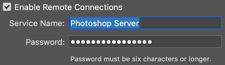

Overview
========

Prerequisites
-------------

Photoshop must be configured to accept remote connection.

Open the plug-ins dialog from the `Preferences` > `Plug-ins...` menu in
Photoshop, and check `Enable Remote Connections` option. Enter password to the
given field, and click `OK` button and restart Photoshop.

Photoshop must be launched and running for the package to work.

Usage
-----

Create a session with :py:class:`photoshop.PhotoshopConnection`, and use one
of the API method to work on a document.

Open a file, get the thumbnail image, then close the file:

.. code-block:: python

    from photoshop import PhotoshopConnection

    with PhotoshopConnection(password='secret') as conn:
        conn.execute('open(File("/server/path/to/example.psd"))')
        jpeg_binary = conn.get_document_thumbnail()
        conn.execute('activeDocument.close()')

Upload a local PSD file to the server, edit, then download:

.. code-block:: python

    with PhotoshopConnection(PASSWORD) as conn:
        with open('input.psd', 'rb') as f:
            tmpfile = conn.upload(f.read(), suffix='.psd')
        conn.execute('''
        open(File("%s"));
        activeDocument.activeLayer.name = "edited";
        activeDocument.save();
        activeDocument.close();
        ''' % tmpfile)
        with open('output.psd', 'wb') as f:
            f.write(conn.download(tmpfile).get('data'))
        # Don't forget to remove the temp file.
        conn.execute('File("%s").remove()' % tmpfile)
